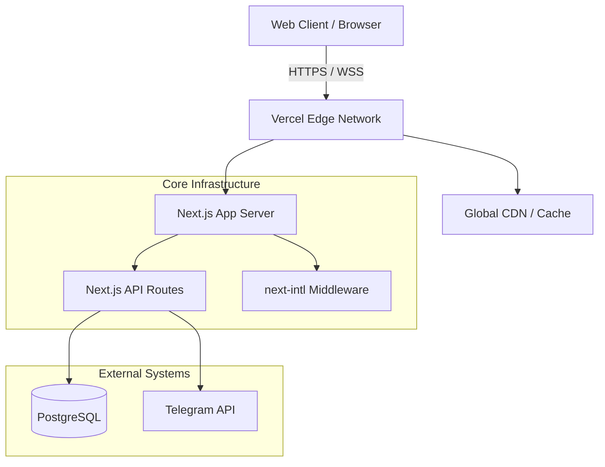

# KHAMIDOV DIGITAL STUDIO: SYSTEM CORE

**DIGITAL SUPREMACY ENGINEERED. NO AMATEURS ALLOWED.**

This is the central repository for the Khamidov Studio platform. If you are reading this, you are either a client trying to understand our stack, or an engineer attempting to contribute. 
If you are the latter, read every single word below. We do not tolerate spaghetti code, untested commits, or "it works on my machine" excuses. 

We build high-performance, massively scalable digital infrastructure.

---

## ⚡ 1. SYSTEM ARCHITECTURE

We do not do monolithic chaos. Our system architecture is designed for isolation, performance, and scaling.



---

## 📂 2. TOPOLOGY (KNOW WHERE YOU ARE)

Don't drop files randomly. Respect the domain boundaries.

```text
src/
├── app/                  # Application routing & SSR pages (Next.js 15)
│   ├── [locale]/         # Strict localized views
│   └── api/              # Backend endpoints & Webhooks
├── components/           # UI Layer (Dumb components only, no business logic)
├── i18n/                 # Localization dictionaries and routing rules
└── middleware.ts         # Edge middleware for auth & geo-routing
messages/                 # Translation JSONs (en, ru, uz). Keep them alphabetized.
```

---

## 🚀 3. BOOTSTRAPPING THE CORE (LOCAL DEV)

Do not attempt to run this without understanding your environment.

### Prerequisites
- **Node.js** >= 18.17.0 (Use nvm, don't ask us why your system Node failed)
- **Git** (Configured with SSH, stop using HTTPS)

### Ignition
```bash
# 1. Clone the core
git clone git@github.com:khamidovkhusnidd1n/myservices.git

# 2. Install dependencies (Strict lockfile usage)
npm ci

# 3. Ignite local environment
npm run dev
```
If it crashes, check your ports. It runs on `http://localhost:3000`.

---

## 🛑 4. RULES OF ENGAGEMENT (CONTRIBUTING)

If you are opening a Pull Request, abide by these rules, or your PR will be closed without a comment.

1. **No "Vibe Coding":** Plan your architecture before you write a single line. 
2. **Type Safety is Mandatory:** `any` is forbidden. If we see `//@ts-ignore` in your PR, you are out.
3. **Commit Standards:** We use Conventional Commits. 
   - Good: `feat(ui): implement brutalist hero section`
   - Garbage: `fixed stuff`
4. **Performance:** 100/100 Lighthouse score. If your code drops performance, refactor it.

---

## 📞 5. COMMAND CENTER

Forget filling out generic contact forms. We speak directly to decision-makers.

- **Direct Line:** `+998 87 087 16 04`
- **Secure Comms (Telegram):** [@khusniddinkhamidov](https://t.me/khusniddinkhamidov)

**WE DON'T DO TEMPLATES. WE DON'T DO CHEAP. WE WRITE CODE THAT DESTROYS COMPETITION.**
